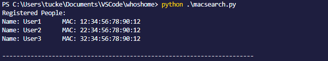
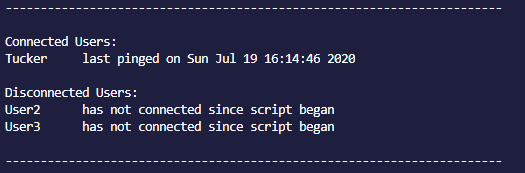
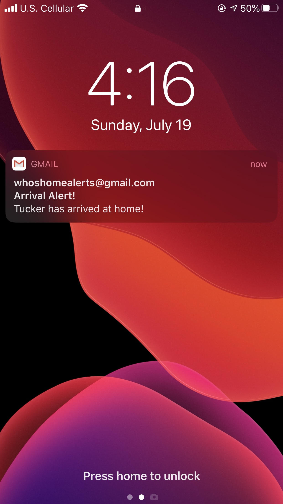
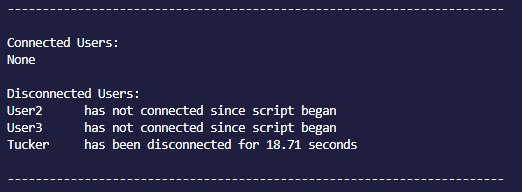

# Who's Home

## About

Who's home is a tool for polling your home's local network and sending an alert whenever someone arrives. Simply install the necessary components, configurate as shown below, and you're off! This toll associates MAC addressed with people, and when a certain MAC is detected as being connected to your network, it alerts that the associated person has arrived. It keeps track of how long since the user's device has last pinged on the network, and after an hour of no connection, that user is no longer considered as being home.

## Setup

Your computer must have the Nmap security Scanner for Linux/Mac which you can download [here](https://nmap.org/download.html). You must also have a Gmail account with 2-step verification setup in order to send the email alerts. Since this application does not support 2-Step verification, you must create an app password in order to authenticate with the Gmail account. You can simply do that [here](http://myaccount.google.com/apppasswords). Once this is done, create a file named ```config.py``` as below. You must have ```alertemail.py```, ```config.py```, and ```macsearch.py``` in the same directory.

```python
email_address = "SendingGmailAccount@Gmail.com"
email_password = "YourAppPassword"

email_list = ["Email1@email.com", "Email2@email.com", "Email3@email.com"]

known_macs = {
    '12:34:56:78:90:12' : 'User1',
    '12:34:56:78:90:12' : 'User2',
    '12:34:56:78:90:12' : 'User3',
}
```

The "email_address" and "email_list" variables are the credentials for the Gmail account which will be sending the alerts. The "email_list" list contains the emails which will receive alerts. Lastly, "known_macs" is a dictionary of MAC addresses and the names of who the people they're associated with.

## Running

To run this, simply enter ```python macsearch.py``` to kick the script off. On initial startup, all registered users are listed for reference:

<div style="text-align:center"></div>

Once it's running, and a known MAC connects, the emails in the email list are alerted and the connected person is moved to active users:

<div style="text-align:center"></div>

With an alert like this:

<div style="text-align:center"></div>


After 1 hour of inactivity, they are moved back to disconnected users:

<div style="text-align:center"></div>